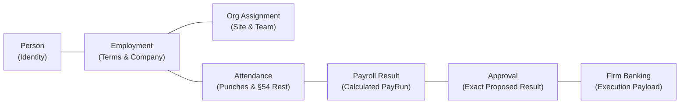
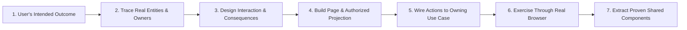

# Object Engine & The Connected Enterprise Experience

> **Authority**: Core Architecture & Operational Semantics Charter  
> **Target System**: Acme Group / Oyatie Console (`oyatie/console` & `frontend`)  
> **Core Premise**: The reason to build an entity/object engine is to make Console understand the business as a connected system—not merely store information behind separate forms.

---

## 1. Why an Object Engine? Understanding vs. Separate Forms

A conventional enterprise application can have a people table, an organization screen, a payroll module, and an approval inbox, yet leave users responsible for understanding how they connect.

An **object engine gives those connections explicit meaning**:
- This **person** has this **employment**, with this **Company**, assigned to this **team** during this **period**.
- This **payroll result** comes from those **employment terms** and **attendance records**.
- This **approval** applies to that exact proposed **result**.

### The Architectural Distinction
Having parts of that architecture (typed objects, owning operations, governed projections) does not mean the complete engine—or the intuitive experience it should enable—is finished.

> **Crucial Rule**: The object engine makes a coherent experience possible; it does **not** automatically design that experience.

---

## 2. Why Objects Are Useful Beyond Ordinary Records

A useful business object combines several distinct elements:

| Element | What it means in Console |
| :--- | :--- |
| **Stable identity** | A person remains the same person when their name, employment, or assignment changes. |
| **Typed properties** | Money, dates, periods, and references have explicit meaning and validation. |
| **Relationships** | An employment connects a person, employer, terms, and organizational assignments. |
| **State and history** | Current, proposed, and historical information remain strictly distinguishable. |
| **Available actions** | The system knows which business operations apply to this object in its current state. |
| **Policy** | The system knows what the current user may see and do under Cedar/PBAC. |
| **Provenance** | A result can explain which sources, rules, and decisions produced it. |

### Concrete Scenario: Transferring Someone to Another Department
- **Without explicit object semantics**: The interface offers a department dropdown and updates a database column. The user has to guess whether that also alters reporting lines, payroll treatment, approval chains, or historical records.
- **With explicit objects and actions**: *“Transfer”* is a defined operation that understands the current assignment, eligible destinations, effective date, required four-eyes review, and resulting history. The interface can explain those consequences because the engine actually models them.

### Single Canonical Truth Across Surfaces
A person page, organization view, payroll worksheet, and approval request can all refer to the **same employment**. Editing through one authorized surface invokes the same canonical owner as editing through another.

---

## 3. What the Palantir Influence Should—and Should Not—Mean

The useful Foundry/Ontology idea is the connection between data and operational meaning:

$$\text{Source information} \longrightarrow \text{Governed objects and relationships} \longrightarrow \text{Analysis and decisions} \longrightarrow \text{Authorized actions}$$

For Console, that translates to:

$$\text{Attendance and employment terms} \longrightarrow \text{Payroll preparation} \longrightarrow \text{Discrepancy analysis} \longrightarrow \text{Source correction} \longrightarrow \text{Review} \longrightarrow \text{Approved payroll result}$$

### Analysis Connected to Action
A discrepancy is not merely a red number in a report; it identifies its source, opens the relevant record, and offers the permitted repair.

### Enterprise Synthesis
- **SAP**: Business objects and role-oriented applications to organize enterprise operations.
- **Workday**: Connects worker and organizational information to business processes and approvals.
- **Salesforce**: Connects records, relationships, and contextual actions.
- **Palantir**: A semantic layer connecting operational objects, source data, and actions.
- **Slack**: Persistent context, search, unread state, and conversations around ongoing work.

### What NOT to Copy
Console borrows the coherent model and effective interaction patterns. It **must not**:
- Require users to learn ontology terminology.
- Force users to build everything in a graph editor.
- Turn payroll into an arbitrary, configurable generic object.

---

## 4. The Engine Needs Business Meaning, Not Generic Flexibility

A system that lets users create arbitrary types and properties is not yet a useful business object engine. It must know what changes are valid, who owns them, and what they mean over time:

### 1. One Authoritative Owner for Each Business Transition
- Employment changes belong to the **employment owner**.
- Payroll approval belongs to the **payroll and approval boundaries** established for that operation.
- A spreadsheet, import, API, automation, or UI must invoke that owner. None should acquire a second way to mutate the same truth directly.
- *Rationale*: A second writer causes the same apparent action to behave differently depending on where the user performs it, destroying both correctness and learnability.

### 2. Explicit Time and Version Semantics
- *“What is true now?”*, *“What was true in September?”*, and *“What will take effect next month?”* are fundamentally different questions.
- An approval must bind to the **exact proposed revision it reviewed**. A later edit cannot silently inherit that approval.

### 3. Relationships That Carry Meaning
- *“Related to”* is insufficient. The real relationship is *“employed by,”* *“assigned to,”* *“reviewed by,”* or *“calculated from.”*
- Those specific meanings determine navigation, valid choices, consequences, and disclosure rules.

### 4. Actions with Shared Preflight and Execution Rules
- The interface asks what is currently possible and why. Execution enforces the exact same rules against current state.
- Preflight can explain that a transfer requires an effective date or that payroll submission has unresolved discrepancies. (Preflight does not guarantee perpetual success: another user may modify the record before submission).

### 5. Authorized Projections Designed for the Task
- A page needs a safe, useful representation of the object—not a raw database row.
- An approver needs the proposed change, relevant evidence, and consequences, while lacking permission to inspect unrelated salary details or confidential files.
- Relationship links, counts, search results, and previews also need authorization. Hiding a field on the final page is too late if its value already leaked into search.

### 6. Durable Outcomes and Understandable Recovery
- Commands need identities, expected revisions, and durable results.
- The interface distinguishes `saved`, `submitted`, `approved`, `rejected`, `conflicting`, and `unconfirmed` outcomes.
- This makes *“resume,”* *“retry this request,”* and *“show what changed”* reliable product features.

---

## 5. How the Engine Should Appear to a User

Most users should **never have to think *“I am operating an object engine.”*** They experience its benefits as ordinary, intuitive product behavior:

- Selecting a person fills in the correct references automatically.
- Opening an employment displays its Company, terms, assignments, and relevant history.
- Selecting a team offers actions appropriate to that specific team.
- Opening an approval shows exactly what will change.
- Clicking a payroll discrepancy takes them straight to the relevant evidence.
- Returning from that evidence preserves the payroll work they were doing.
- Search finds the same record they recognize elsewhere.
- A saved link reopens that record, subject to current access.

### Navigational Continuity, Not a Visible Graph
The backend graph becomes **navigational continuity**, not necessarily a visible graph diagram. A directory, hierarchy, timeline, table, or focused review page is often far superior for everyday work.

Shared object semantics must not produce a "universal form generator." Payroll review and organization editing share identities, policy, and action contracts, but they require distinct, purpose-built compositions.

---

## 6. What Games and Game Engines Teach Us

Games teach complicated systems through interaction. Their strongest lesson is **consistency between the world, available actions, and feedback**:

| Game Principle | Console Application | Necessary Adaptation |
| :--- | :--- | :--- |
| **Persistent entities** | Recognizable people, teams, employments, and payroll periods. | Preserve business identity and history. |
| **Selecting an entity reveals its capabilities** | An object inspector shows relevant facts and authorized actions. | Recheck authorization dynamically when acting. |
| **A visible objective** | A task explains what must be completed and why. | Use actual assigned work and business deadlines. |
| **Actions have prerequisites** | Explain missing evidence, invalid scope, or required review. | Reveal reasons only when permitted by policy. |
| **Preview before placement or commitment** | Show a proposed assignment or side-by-side change comparison. | Derive consequences from real domain rules. |
| **Immediate feedback** | Show save, submission, review, and completion states. | Never imply a durable result before server confirmation. |
| **Progress persists** | Reopen drafts, requests, and interrupted work intact. | Persist acknowledged changes durably on the server. |
| **Simple actions teach deeper mechanics** | Introduce relationships through useful everyday tasks. | Preserve fast, efficient paths for experienced users. |

### The Construction Pattern Applied to Organization Setup
In a construction/strategy game:
1. Select what you want to build.
2. Point to a valid location.
3. See whether placement is allowed and what it costs.
4. Confirm.
5. See the resulting object and what it can do next.

In Console’s Organization Setup:
1. Select the **Company** or **Site**.
2. Choose **“Add department”**.
3. Enter the name and genuinely required information.
4. See the parent relationship and effective date prefilled.
5. Save or submit according to real business rules.
6. See the actual saved or proposed department in its correct position.

*Result*: The parent relationship is already selected. Impossible parents are excluded. The result is visible in context. Users learn the domain model simply by completing the task—far superior to filling in fields named `parent_id`, `kind`, and `effective_from`.

### Separation of Responsibilities
Analogous to a game engine:
- **Authoritative business state**: Employment, approved payroll, assignments, and permissions.
- **Business rules and commands**: What transitions are valid.
- **Read projections**: What a particular task and user need to see.
- **Presentation**: Pages, tables, inspectors, and controls.
- **Temporary interaction state**: Selection, expanded panels, unsaved input, and local previews.

The browser owns temporary interaction state. It **never owns approval truth or payment status**.

---

## 7. What Actually Makes the Experience Learnable: The Universal Loop

The core is a small interaction vocabulary that remains consistent as the domain becomes deeper:

$$\textbf{Find} \longrightarrow \textbf{Inspect} \longrightarrow \textbf{Choose an action} \longrightarrow \textbf{Supply missing information} \longrightarrow \textbf{Review consequences} \longrightarrow \textbf{Commit} \longrightarrow \textbf{Track the result}$$

Users learn this pattern once. It behaves predictably whether approving a budget, onboarding an employee, or adjudicating a 52h attendance exception.

### Explaining Unavailability
The interface must communicate why an action is unavailable when safe to do so:
- *Good*: `“Resolve these two attendance discrepancies before submission”` (teaches the system).
- *Unacceptable*: A permanently disabled button with no explanation (teaches nothing).

---

## 8. Implementation Methodology: Complete User Tasks

The implementation unit is a **complete user task crossing the object model**, not an isolated object type, backend subsystem, or detached screen:

### The Connected Priority Path
$$\textbf{Organization} \longrightarrow \textbf{People} \longrightarrow \textbf{Employment} \longrightarrow \textbf{Payroll Preparation} \longrightarrow \textbf{Approval}$$
*(with the ability to revisit, examine consequences, and correct at each stage)*

The true test of the object engine is whether a user can move through connected work without re-entering context, guessing relationships, or losing progress.
