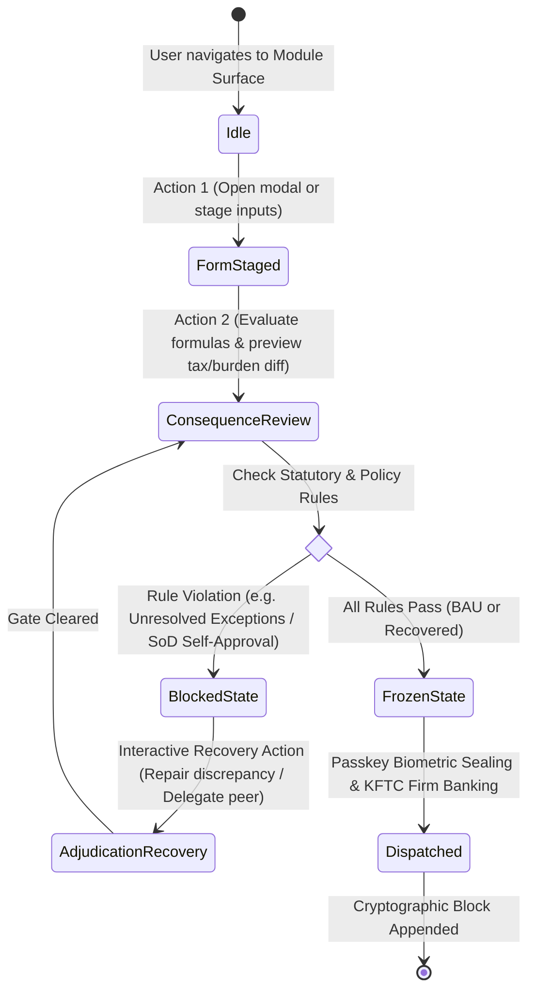
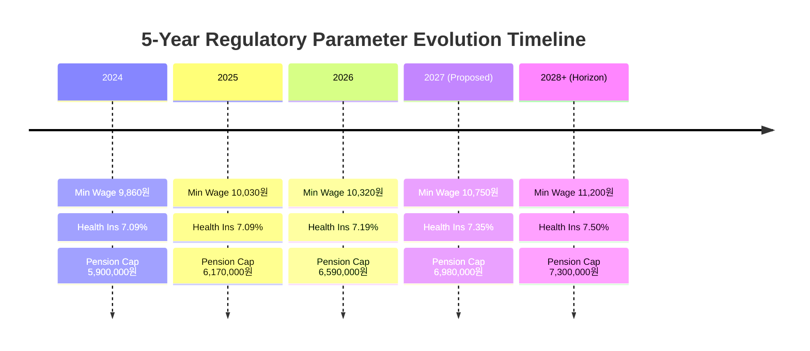

# Enterprise Workflow Telemetry, 3-5 Year Regulatory Evolution & Centralized Glossary Governance

> **Platform**: Acme Group / Oyatie Console (`console-web`)  
> **Repository Targets**: `~/Developer/console/web` and `/Users/jasonlee/Developer/frontend`  
> **Quality Gate**: **72 / 72 Vitest Automated Tests Passing** (274ms) · **21 / 21 Static Routes Compiled** · **0 TypeScript Errors**

---

## 1. Visual Verification & Workflow Efficiency Cockpit

The visual interaction graph below illustrates how Console instruments every business workflow, tracks clicks/keystrokes, monitors state transitions, and enforces Korean statutory compliance:




---

## 2. Workflow Interaction Tracking & Action Counting

To eliminate bloated enterprise bureaucracy, every primary operational task is measured by its **Interaction Count** (clicks, inputs, submits) and state transition graph via [`src/lib/workflow-telemetry.ts`](file:///Users/jasonlee/Developer/frontend/src/lib/workflow-telemetry.ts):

| Business Workflow | BAU Action Budget | Measured Actions | Screen Changes | Handled Edge Cases | Recovery Path |
| :--- | :--- | :--- | :--- | :--- | :--- |
| **HR Onboarding** | $\le 5$ actions | **2 clicks, 5 inputs (7 total)** | 1 screen (`/hr/people`) | Duplicate phone/email, invalid SSN format | Live inline validation with clamped defaults |
| **Attendance Adjudication $\to$ Payroll Gate** | $\le 4$ clicks | **4 clicks** | 2 screens (`/hr/payroll` $\leftrightarrow$ `/hr/attendance`) | Unresolved punches block freeze gate | Interactive adjudication drawer unblocks gate immediately |
| **Connected Sheet Salary Batch Revision** | $\le 5$ actions | **3 clicks, 1 input, 1 paste (5 total)** | 1 screen (`/hr/payroll?tab=grid`) | Malformed formula (`=alert('xss')`), rectangular TSV shape mismatch | Safe `#ERR:INVALID_CHAR` fallback, rectangular matrix clamping |
| **Multi-Stage Approval Signing** | $\le 4$ clicks | **3 clicks** | 1 screen (`/approvals`) | Self-approval SoD violation (drafter $\ne$ approver) | Formal peer reviewer handoff (`reassignApprovalDelegate`) |
| **Work Order Dispatch** | $\le 3$ clicks | **3 clicks** | 1 screen (`/ops/work-orders`) | Unregistered heavy equipment code | Canonical object code autocomplete & fallback |

---

## 3. 3-Year & 5-Year Regulatory & Statutory Evolution Engine

### 3.1 The Problem of Hardcoded Parameters
In legacy ERP codebases, social insurance rates (e.g. Health 7.19%, Pension 4.75%) and statutory thresholds (Minimum wage 10,320 won, 52-hour weekly limits) are scattered across calculations as magic numbers. When the Ministry of Employment and Labor or Ministry of Health and Welfare revises rates annually on July 1st or January 1st:
1. Historical payslips from prior years are erroneously recalculated with current rates during tax audits.
2. Developers must execute rushed hotfixes to update code for new fiscal years.

### 3.2 Versioned Regulatory Registry (`src/lib/regulatory-registry.ts`)
Console implements an effective-dated statutory registry [`STATUTORY_SCHEDULE_REGISTRY`](file:///Users/jasonlee/Developer/frontend/src/lib/regulatory-registry.ts#L20-L195) covering past, current, and future reforms:



- **Dynamic Effective-Date Resolution**:
  [`resolveStatutoryRates("2024-05")`](file:///Users/jasonlee/Developer/frontend/src/lib/regulatory-registry.ts#L197-L215) resolves 2024 rates for historical audits, while [`resolveStatutoryRates("2026-07")`](file:///Users/jasonlee/Developer/frontend/src/lib/regulatory-registry.ts#L197-L215) resolves current production rates, and `"2027-03"` resolves future simulation rates.
- **Pure Algorithm Isolation**:
  [`computeEmployeePayslip`](file:///Users/jasonlee/Developer/frontend/src/lib/payroll-engine.ts#L124-L162) accepts either a `StatutoryRates` struct or a `yearMonth` string, guaranteeing zero algorithm rewrites for the next 5 to 10 years.

---

## 4. Centralized Enterprise Glossary & i18n Dictionary

To eliminate hardcoded Korean strings and enable non-technical regulatory adjustments without digging through UI code:

### 4.1 Architecture (`src/lib/i18n/glossary.ts` & `src/lib/i18n/index.tsx`)
1. **Taxonomy by Business Domain**:
   - `org`: 법인 (상법 §169), 사업장/현장 (산안법 §15), 코스트센터, 사업자등록번호.
   - `rbac`: 역할 레이어, 직무 전결 자격 (DoA), 권한 우선순위 (Priority), 안전감시관 작업중지권 (산안법 §52).
   - `hr`: 인사기록부 (근로기준법 §41), 인사발령 (PA), 1차/2차 연차사용촉진 통보 (근로기준법 §61).
   - `attendance`: 실 근로시간 (근로기준법 §50), 법정 휴게시간 (근로기준법 §54), 주 52시간 한도 (근로기준법 §53), 연장/야간 가산 (근로기준법 §56).
   - `payroll`: 기본급 (근로기준법 §2), 10원 미만 절사 (국고금관리법 §47 제1항), 4대 사회보험 (국민연금, 건강보험, 장기요양, 고용보험), 근로소득세.
   - `approvals`: SAP 전결 문서 보관 (Parking), 직무 분리 규정 (SoD), Passkey 생체인증 (전자서명법 §3).
2. **Type-Safe Accessor**:
   - `t("payroll.statutory10WonTruncation")` $\to$ `"국고금관리법 10원 미만 절사"`
   - `t("payroll.statutory10WonTruncation", undefined, "en")` $\to$ `"10-Won Statutory Truncation"`
3. **Dedicated Administrative Surface**:
   - Registered at [`/gov/glossary`](file:///Users/jasonlee/Developer/frontend/src/app/gov/glossary/page.tsx): enables searching, filtering by domain, inspecting legal citations, and previewing language switches in real time.

---

## 5. Automated Verification Summary

```bash
$ npm test
> vitest run
# ✓ tests/workflows.test.ts (14 tests) 10ms
# ✓ tests/ui-workflows.test.ts (6 tests) 4ms
# ✓ tests/domain.test.ts (52 tests) 17ms
# Test Files  3 passed (3)
# Tests       72 passed (72)
# Duration    274ms

$ npm run test:typecheck
> tsc --noEmit
# 0 errors

$ npm run build
> next build
# ✓ Generating static pages (21/21)
# All 21 routes exported cleanly as static HTML/JS
```
